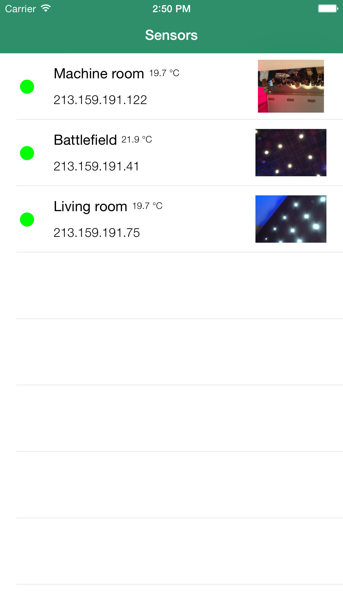

# Rosa
iOS-app for displaying sensor data (camera / temperature) collected from a cluster of Raspberry Pis. Created during the Raspberry Pi challenge at Ericsson E-Hack 2015.

* App in portrait mode with connected sensors

* App in cinema mode with disconnected sensors

